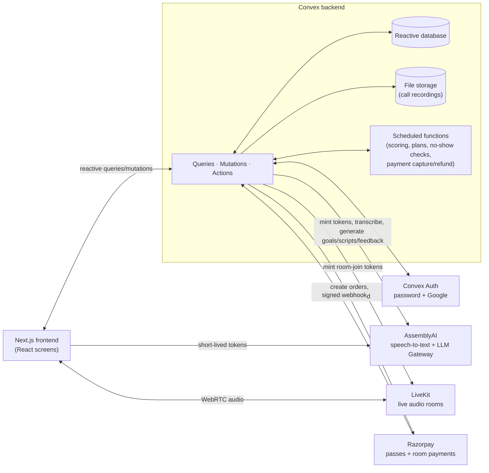

# SpeakUp

**Learn and speak what matters most.**

SpeakUp is an adaptive spoken-language learning platform built around a learner's
real-world goal.

Instead of teaching the same vocabulary and lessons to everyone, SpeakUp starts
with a specific situation — for example:

- explain symptoms to a doctor
- prepare for a job interview
- speak at work
- travel confidently
- handle everyday conversations

It identifies what the learner can already use, what they are still learning,
and what they need for that particular goal.

The learning loop is:

**Goal → spoken level check → adaptive learning plan → focused practice →
speaking evidence → next learning**

---

## Why SpeakUp

Traditional language-learning apps often organize learning around generic
levels and fixed courses.

But two learners who both want to improve English may need completely different
language.

Someone preparing to speak to a doctor may need:

- symptom vocabulary
- time and duration expressions
- pain descriptions
- question patterns

Someone preparing for a job interview may instead need:

- experience descriptions
- project vocabulary
- achievement language
- clarification and follow-up patterns

SpeakUp creates learning around the situation the learner actually needs.

---

## How it works

### 1. Choose your languages

The learner selects:

- languages they already know
- their primary language
- the language they want to learn

The learner's primary language is used for meanings, explanations,
pronunciation guidance, and summaries.

---

### 2. Set a real-world goal

The learner describes what they need to do.

For example:

> I need to explain my symptoms to a doctor.

SpeakUp generates a goal-specific language target containing:

- vocabulary
- useful language patterns
- level-check words
- speaking prompts

---

### 3. Spoken level check

The learner speaks rather than completing a generic multiple-choice placement
test.

The check currently includes:

- 5 target words
- 2 spoken prompts

AssemblyAI handles speech recognition.

SpeakUp then evaluates the learner relative to the current goal.

The result is organized as:

- **Can use**
- **Practising**
- **Not yet**

This is deliberately goal-relative rather than a permanent global language
score.

---

### 4. Adaptive learning plan

SpeakUp combines:

- the learner's goal
- spoken evidence
- vocabulary performance
- grammar evidence
- available daily study time
- deadline

to produce either:

- a focused multi-day learning plan
- or a Quick Prep plan for urgent situations

The learner does not need to study language they already demonstrated.

---

### 5. Daily practice (the Lab)

Every plan day has a short, focused practice session:

- learn today's words and pattern, with normal and slow pronunciation
- a grammar check (tap the word that completes the sentence)
- a story with fill-in-the-blank lines, answered by tapping or speaking
- an instant correction screen showing the right answer, in the learner's
  own language
- optional speaking practice on every sentence, with the app reading it
  aloud as a fallback

Vocabulary guidance is written in a script the learner already understands.

```text
appointment
अपॉइंटमेंट
```

A word only moves to **Can use** once the learner has produced it — tapping
the right answer alone is weaker evidence than saying it out loud.

---

### 6. Practice with a real partner (Rooms)

When a learner is ready to hold a real conversation, they can book a short
live session — 5, 10, or 15 minutes — with another person, either **now**
(matched immediately from whoever is free) or **later** (a scheduled slot).

Before the session, SpeakUp drafts a short practice script from the
learner's own goal vocabulary, which they can edit freely. During the call:

- speech is transcribed live and checked against the script, line by line
- if the learner goes quiet after a partner line, the partner is cued to
  read it again, slowly
- a two-tier safety check (fast rule-based, then AI-confirmed for
  borderline cases) keeps the conversation on track

Afterwards, the learner gets a session report: lines completed, target
words used, longest pause, speaking speed, how much of the conversation
they spoke, and short written feedback in their own language. Words they
actually produced in conversation move to **Can use** — the strongest
evidence there is.

### 7. Partners get paid

Anyone fluent in a supported language can apply to be a partner: take a
short speaking test, set the hours they're free, and start accepting
session requests. Partners see their upcoming sessions, toggle availability
in real time, and track earnings — paid once a session completes, refunded
automatically if a learner doesn't show, and withheld if a partner doesn't.

### 8. Passes

Access is via a simple weekly or monthly pass, purchased through Razorpay.
Room sessions are priced and booked separately, on top of an active pass.

---

## Architecture



The frontend never talks to AssemblyAI, LiveKit, or Razorpay with a long-lived
secret — Convex mints a short-lived token (or verifies a signature) for every
one of those calls, and every function checks that the caller owns whatever
it's reading or writing before touching the database.

---

## Tech stack

- **[Convex](https://convex.dev)** — database, server functions, scheduled
  jobs, file storage, and realtime sync, all in one type-safe backend
- **Next.js** (App Router) — the web frontend
- **Convex Auth** — email/password and Google sign-in
- **AssemblyAI** — live speech-to-text and the LLM Gateway used for goal
  generation, scoring, scripts, and feedback
- **LiveKit** — the audio call inside a live room
- **Razorpay** — passes and room-booking payments

---

## Getting started

```bash
npm install

# Backend — watches convex/ and pushes changes live
npm run dev

# Frontend — in a second terminal
npm run dev:web
```

Open `http://localhost:3000`.

### One-time setup

```bash
# Creates/connects the Convex deployment
npx convex dev --once

# Convex Auth (password + Google)
npx @convex-dev/auth --skip-git-check --web-server-url http://localhost:3000

# Required: speech-to-text and the LLM Gateway share one key
npx convex env set ASSEMBLYAI_API_KEY ...

# Required for live rooms
npx convex env set LIVEKIT_URL ...
npx convex env set LIVEKIT_API_KEY ...
npx convex env set LIVEKIT_API_SECRET ...

# Required for passes and room-booking payments (test mode is fine)
npx convex env set RAZORPAY_KEY_ID ...
npx convex env set RAZORPAY_KEY_SECRET ...
npx convex env set RAZORPAY_WEBHOOK_SECRET ...
npx convex env set RAZORPAY_PRICE_WEEK 39900   # smallest currency subunit
npx convex env set RAZORPAY_PRICE_MONTH 149900
```

> The AssemblyAI account needs **LLM Gateway access enabled** — without it,
> every generation call fails even though the same key works for
> speech-to-text.

### Checks

```bash
npm run typecheck   # tsc --noEmit
npm run verify      # backend checks against a real deployment
npm run seed        # a full learner + partner + room journey, idempotent
```

---

## Project structure

```
convex/         backend: schema, functions, and the LLM/scoring/payment logic
src/app/        Next.js routes (one folder per screen)
src/components/ screen-level React components, grouped by feature
scripts/        verify.ts and e2e.ts — the checks above
docs/           design notes for individual features
```

Every learner-facing table lookup goes through an index, and every function
checks that the caller owns whatever it's reading or writing — there is no
function that trusts a client-supplied user id.
