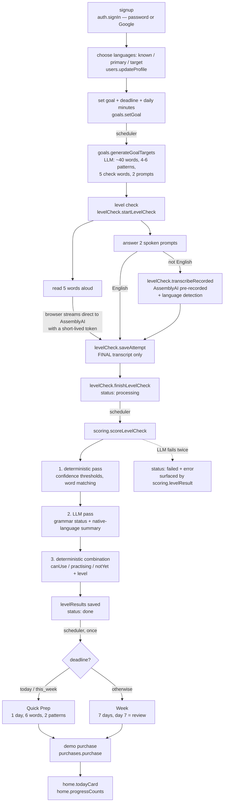

# SpeakUp by AdaptiveSkills — Convex backend

A **backend-only** Convex application. There is no frontend in this repository.

SpeakUp helps an adult learner reach one specific real-world English goal
("explain my symptoms to a doctor", "pass a job interview"). It generates a
goal-specific vocabulary, runs a spoken level check, scores it **goal-relative**
(can use / practising / not yet), and produces either a 7-day plan or a
single-day Quick Prep.

---

## Contents

- [Setup](#setup)
- [Environment variables](#environment-variables)
- [User flow](#user-flow)
- [Function list by file](#function-list-by-file)
- [Design rules the code enforces](#design-rules-the-code-enforces)
- [Scripts](#scripts)
- [AssemblyAI integration notes](#assemblyai-integration-notes)

---

## Setup

```bash
npm install

# Creates / connects the Convex dev deployment and generates convex/_generated
npx convex dev --once

# One-time Convex Auth key setup (writes JWT_PRIVATE_KEY, JWKS, SITE_URL
# onto the deployment, and creates convex/auth.config.ts)
npx @convex-dev/auth --skip-git-check --web-server-url http://localhost:3000

# Required: authenticates BOTH the LLM Gateway and speech-to-text
npx convex env set ASSEMBLYAI_API_KEY ...

# Optional: swap the model, or the whole endpoint, without a code change
npx convex env set LLM_MODEL    gemini-2.5-flash-lite
npx convex env set LLM_BASE_URL https://llm-gateway.assemblyai.com/v1/chat/completions

# Optional: Google OAuth sign-in
npx convex env set AUTH_GOOGLE_ID     <client-id>
npx convex env set AUTH_GOOGLE_SECRET <client-secret>
```

> The AssemblyAI account must have **LLM Gateway access enabled**. Without it
> every generation call fails with `400 — Your account does not have access to
> this LLM Gateway model`, even though the same key works for speech-to-text.

Then:

```bash
npm run typecheck   # tsc --noEmit, strict
npm run verify      # 155 checks; fixed accounts, 0 LLM calls after its first run
npm run seed        # full end-to-end flow, idempotent (0 LLM calls on re-run)
npm run seed:fresh  # same, but wipes the test account and regenerates
npm run lang-e2e    # German (hi primary) + Telugu generation, idempotent
npm run test-stream -- --file clip.wav --model u3-rt-pro   # live streaming check
npm run dev         # convex dev (watch mode)
```

> `convex/auth.config.ts` is **mandatory**. Without it, sign-in appears to
> succeed but `getAuthUserId()` returns `null` on every request and every query
> silently returns empty. It is created by the `@convex-dev/auth` command above.

---

## Environment variables

All are read server-side, inside Convex actions, via `process.env`. None are
ever exposed to a client.

| Variable | Required | Used by | Purpose |
|---|---|---|---|
| `ASSEMBLYAI_API_KEY` | yes | `lib/llm.ts`, `lib/assemblyai.ts` | One key, two uses: authenticates the LLM Gateway **and** mints streaming tokens / runs pre-recorded transcription. **Never reaches the browser** |
| `LLM_MODEL` | optional | `lib/llm.ts` | Model name, default `gemini-2.5-flash-lite`. **Never hardcoded** — swap models without a code change |
| `LLM_BASE_URL` | optional | `lib/llm.ts` | Chat-completions endpoint, default `https://llm-gateway.assemblyai.com/v1/chat/completions`. Lets the whole provider be swapped later |
| `JWT_PRIVATE_KEY`, `JWKS`, `SITE_URL` | yes | Convex Auth | Set by the `@convex-dev/auth` CLI. Per-deployment: they do **not** carry from dev to prod |
| `AUTH_GOOGLE_ID`, `AUTH_GOOGLE_SECRET` | optional | `auth.ts` | Google OAuth provider |

---

## User flow



Text version:

```
signup
  -> choose languages (known, primary, target)
  -> set goal + deadline + daily minutes
  -> (scheduled) generate goal targets with the LLM
  -> level check: read 5 words + answer 2 prompts by speaking
  -> (scheduled) score: deterministic -> LLM -> deterministic combination
  -> result: goal-relative can use / practising / not yet + level
  -> (scheduled, once) plan: 7-day week OR 1-day Quick Prep
  -> demo purchase unlocks the lesson bodies
  -> home
```

---

## Function list by file

### `convex/schema.ts`
Tables and their indexes. Also exports the shared validators (`goalTypeValidator`,
`deadlineValidator`, `planDayValidator`, …) reused across every function file.

| Table | Indexes |
|---|---|
| `users` (extends Convex Auth's) | `email`, `phone` |
| `goals` | `by_user`, `by_user_and_active` |
| `goalTargets` | `by_goal` |
| `levelChecks` | `by_user`, `by_goal`, `by_user_and_status` |
| `attempts` | `by_level_check`, `by_level_check_and_kind_and_index` |
| `levelResults` | `by_level_check`, `by_user`, `by_goal` |
| `plans` | `by_goal`, `by_user` |
| `purchases` | `by_plan`, `by_user`, `by_user_and_plan`, `by_user_and_plan_and_type` |

Every read path goes through `.withIndex(...)`. There are no `.filter()` table scans.

### `convex/auth.ts` / `convex/auth.config.ts` / `convex/http.ts`
Convex Auth: **password** provider + **Google** OAuth. `afterUserCreatedOrUpdated`
stamps `createdAt` once, at account creation.

### `convex/users.ts` — profile
| Function | Kind | Notes |
|---|---|---|
| `me` | query | The caller's own profile, or `null` when signed out |
| `updateProfile` | mutation | `knownLanguages`, `primaryLanguage`, `targetLanguage`, `gender` — rule enforced server-side (see [Language support](#language-support)) |

### `convex/goals.ts` — goal + LLM targets
| Function | Kind | Notes |
|---|---|---|
| `setGoal` | mutation | Deactivates old active goals, inserts the new one, schedules generation |
| `generateGoalTargets` | internalAction | LLM: ~40 words with native meanings, 4–6 patterns, 5 check words, 2 prompts |
| `goalContext` | internalQuery | Goal + speaker profile, ownership re-verified |
| `saveGoalTargets` | internalMutation | Idempotent per goal — never regenerates |
| `activeGoal` | query | Active goal joined with its targets, plus `targetsReady` |

### `convex/levelCheck.ts` — the spoken check
| Function | Kind | Notes |
|---|---|---|
| `startLevelCheck` | mutation | Creates the check, returns 5 words + 2 prompts |
| `getStreamingToken` | action | Short-lived AssemblyAI token. Auth-gated |
| `getStreamConfig` | query | `speech_model` + connection params for a `target` / `own` stream. Auth-gated |
| `saveAttempt` | mutation | **Final** transcript only. Idempotent per slot |
| `transcribeRecorded` | action | Storage → AssemblyAI pre-recorded + language detection |
| `assertOwnsLevelCheck` | internalQuery | Ownership check for the action (actions have no `ctx.db`) |
| `saveRecordedAttempt` | internalMutation | Writes the `source: "recorded"` attempt |
| `finishLevelCheck` | mutation | `status: "processing"`, schedules scoring. Idempotent |

### `convex/scoring.ts` — deterministic first, LLM second
| Function | Kind | Notes |
|---|---|---|
| `scoreLevelCheck` | internalAction | The 4-step pipeline. On failure: `status: "failed"` + error |
| `scoringInput` | internalQuery | Attempts + goal + targets + speaker profile |
| `saveLevelResult` | internalMutation | Writes `levelResults`, sets `status: "done"` |
| `markLevelCheckFailed` | internalMutation | Queryable failure state |
| `levelResult` | query | Result **and** the `processing` / `failed` states |

Exported pure functions (unit-tested by `npm run verify`): `normalize`,
`tokenize`, `containsPhrase`, `containsNonLatinScript`, `confidenceFor`,
`gradeWordAttempt`, `analysePromptAttempt`, `combineWordBuckets`, `computeLevel`.

### `convex/plans.ts` — the plan
| Function | Kind | Notes |
|---|---|---|
| `generatePlan` | action | Public, caller-triggered. **No-op if a plan exists** |
| `generatePlanForGoal` | internalAction | Scheduled once, right after scoring succeeds |
| `planContext` | internalQuery | Vocabulary, patterns, and the latest level result |
| `savePlan` | internalMutation | Only replaces when `replaceExisting` is true |
| `plan` | query | The caller's plan for one of their own goals |
| `generatePlanInternal` | helper | Shared core, used by `purchases.regenPlan` |

### `convex/purchases.ts` — demo purchases + access gate
| Function | Kind | Notes |
|---|---|---|
| `purchase` | mutation | `isDemo: true`, `status: "paid"`. Re-buying is a no-op |
| `canAccess` | query | Per-day unlock state |
| `regenPlan` | action | The **only** path that replaces a plan. Requires a paid, unspent regen |
| `regenGate` | internalQuery | Checks for an unspent regen purchase |
| `computeDayAccess`, `priceFor`, `loadPurchases` | helpers | Pure unlock + pricing rules |

Prices (USD): `day` 0.99 · `week` 4.99 · `quick_prep` 0.99 · `regen` 0.49 (one day) / 1.99 (whole week).

Unlock rules: a `week` purchase unlocks all days; a `day` purchase unlocks only
that `dayNo`; `quick_prep` unlocks day 1. **Day 1's preview** (title, words,
patterns) is always visible; the `practiceSummary` lesson body is withheld
server-side until purchased.

### `convex/home.ts` — home screen
| Function | Kind | Notes |
|---|---|---|
| `todayCard` | query | Current plan day + access state. Locked bodies are withheld |
| `progressCounts` | query | canUse / practising / notYet from the latest level result |
| `currentDayNo` | helper | Elapsed-days day selector, clamped to the plan length |

`todayCard` takes `now` as an argument rather than calling `Date.now()`, because
Convex queries are reactive and are not rerun as the wall clock advances.

### `convex/lib/llm.ts`
Wraps the **AssemblyAI LLM Gateway** (`POST /v1/chat/completions`, raw API key
in the `authorization` header — no `Bearer` prefix).

Every call sends `response_format: { type: "json_schema", json_schema: { name,
schema, strict: true } }` plus `post_processing_steps: [{ type: "json-repair" }]`,
so the model is constrained to the shape *and* the gateway repairs stray fences
or trailing commas before the response reaches us. There is still an
`AbortController` timeout, **exactly one retry** (which feeds the previous
failure back to the model), and a typed parse through a caller-supplied
validator — the schema constrains shape, but the validator stays authoritative.
`LlmConfigError` distinguishes "not configured" from "call failed".

`max_tokens` is always sent explicitly: **the gateway defaults it to 1000**,
which silently truncates goal-target and plan generation.

### `convex/lib/assemblyai.ts`
`createStreamingToken()` and `transcribeRecordedAudio()`. The API key stays
server-side; only the short-lived token is returned to a client.

### `convex/lib/validate.ts`
Dependency-free validators for every piece of LLM JSON:
`validateGoalTargets`, `validateGrammarFeedback`, `validatePlanDays`,
plus the `WORDS_PER_DAY` table. Nothing reaches the database without passing through here.

### `convex/llmMetrics.ts` — instrumentation
`record` (internalMutation) appends one `llmCalls` row per HTTP request
`lib/llm.ts` actually sends, **including the retry**, and bumps a denormalised
`llmCallCounter`. `total` and `recent` are auth-gated queries. `llmRecorder(ctx)`
builds the callback passed to `llmJson`, keeping `lib/llm.ts` free of
generated-API imports. Recording failures are swallowed so metering can never
break a generation.

### `convex/dev.ts` — development only
`devReset` (internalMutation) wipes one account's learning state, children
before parents, every query indexed and bounded. Internal-only: the seed script
invokes it through the Convex CLI, so it is never client-reachable. It exists
solely to support `npm run seed:fresh`.

### `convex/migrations.ts` — one-off backfills (internal only, via the CLI)
| Function | Kind | Notes |
|---|---|---|
| `backfillUserLanguages` | internalMutation | `nativeLanguage` → profile, one page per call; idempotent |
| `backfillPronunciationHints` | internalAction | ≤1 LLM call per goal, only for words missing a hint; copies hints into the plan |
| `hintBackfillInput` / `applyPronunciationHints` | internalQuery / internalMutation | deterministic halves of the above |

### `convex/lib/languages.ts`
Pure language model: profile rule, legacy mapping, script detection,
German-aware `foldForMatching` / `matchTokens`, the generation-language
snapshot resolver, the shared pronunciation-hint prompt text, and
`streamRouteFor`.

### `convex/lib/authz.ts`
`requireUserId`, `requireUser`, `requireOwnedGoal`, `requireOwnedLevelCheck`,
`requireOwnedPlan`, `loadActiveGoal`, and the `ConvexError` helpers.

---

## Language support

### Profile
| Field | Values | Rule |
|---|---|---|
| `knownLanguages` | `en` `hi` `te` | ≥1, de-duplicated |
| `primaryLanguage` | `en` `hi` `te` | must be one of `knownLanguages`; UI, meanings, hints, summaries |
| `targetLanguage` | `en` `de` | may not be the **only** known language (`["en"]` + `en` rejected; `["en","hi"]` + `en` allowed) |

Enforced server-side in `users.updateProfile`; the caller is always the
authenticated user. `setGoal` and `getStreamConfig` refuse until a profile exists.

**Migration (widen → migrate → narrow).** (a) new optional fields deployed
alongside the old `nativeLanguage`; (b) `migrations.backfillUserLanguages`
mapped `hi`/`te` → `[x]/x/en`, `en` → `[en]/en/de`, and removed the legacy
field from every row (26 users: 17 migrated, 9 had no language, 0
unsupported; a re-run changes nothing); (c) `nativeLanguage` removed from the
schema — the deploy validated every existing row.

### Generation-language snapshot
`goalTargets` stores the `targetLanguage` + `primaryLanguage` it was generated
in. Scoring, plans, hint backfill and stream routing read the **snapshot**, not
the live profile, so changing your profile later can never make German words
be scored, planned or streamed as English. Pre-snapshot rows were produced by
the old English-only generator, so they resolve to target `en` (a fact, not a
guess) and were stamped by the hint backfill.

### Pronunciation hints
Every generated word carries `pronunciationHint`: how the **target** word
sounds, written in the **primary** script — `Guten Tag` → `गूटेन टाग` (hi),
`గూటెన్ టాగ్` (te), `GOO-ten tahg` (en). `lib/validate.ts` requires it and
checks deterministically that every letter is in the right script (Devanagari /
Telugu / Latin) and, for hi/te, that it does not just repeat the word. Plan
words copy hints from `goalTargets` by word — the plan LLM is never asked.

### German-aware scoring
`foldForMatching`: NFC, case-folded, `ß`/`ẞ` → `ss`, `ä ö ü` → `ae oe ue`.
Umlauts are **expanded, not stripped**, so `für ≡ fuer` and `Straße ≡ Strasse`
but `schon ≠ schön`. Tokens are `\p{L}\p{M}\p{N}` runs (combining marks kept, or
Hindi/Telugu words break). Phrase matching works on token spans joined without
spaces, which also credits a compound that speech recognition **split**
(`Fremdenführer` heard as `fremden Führer` — observed live) while keeping
whole-token boundaries (`test` never matches inside `testing`). Prompt answers
report **target-language** word counts and which of the learner's **own**
languages appeared (Devanagari → hi, Telugu → te, plus the detected language).
Gendered phrasing is used only for Hindi summaries.

### Streaming model routing — `levelCheck.getStreamConfig({ purpose })`
| Purpose | Language | `speech_model` |
|---|---|---|
| `target` | en / de | `u3-rt-pro` |
| `own` | hi / te | `whisper-rt` |
| `own` | en | `u3-rt-pro` |

It returns `connectionParams` (`speech_model`, `language_detection: "true"`) for
the browser to add to the WebSocket URL. **Docs vs reality:** the current
AssemblyAI docs list only `universal-3-5-pro` / `universal-streaming-*` and say
`language_detection` works on `universal-3-5-pro`/multilingual only. Live, the
server's own validation error enumerates `whisper-rt` and `u3-rt-pro` as valid,
both open sessions with a temp token from `getStreamingToken`, and `u3-rt-pro`
returns `language_code` only when `language_detection=true` (whisper-rt detects
natively). Telugu is not listed for any current Universal model, which is why
`te` routes to `whisper-rt`.

## Design rules the code enforces

**1. AI output never writes learner state directly.**
Every LLM response passes through `lib/validate.ts` and then through
deterministic combination rules before any write:

- *Goal targets*: word count, pattern count, exactly 5 distinct check words,
  exactly 2 prompts. Words are de-duplicated and `priority` is clamped server-side.
- *Grammar*: the model may only supply a **status** for each server-supplied
  pattern. Patterns it invents are discarded; patterns it omits default to `not_yet`.
- *Plan*: day counts and per-day word counts are checked against the
  `minutesPerDay` table, `dayNo` is assigned by position, and every word and
  pattern is reconciled against the goal's own vocabulary. Native-language
  meanings always come from the database, never from the model. A hallucinated
  word fails validation, which triggers the single retry.

**2. Scoring order is deterministic → LLM → deterministic.**
1. Word attempts graded on confidence (`≥0.8` clear, `0.5–0.8` unclear, else not yet);
   prompt answers scanned for goal words, English word count, and first-language use.
2. LLM supplies only a grammar status per pattern and a native-language summary.
3. Buckets and level computed by rule alone: used in an answer → `canUse`;
   clear in the word test but unused → `practising`; otherwise → `notYet`.
   Level from `known/total`: `<15%` starting, `<40%` basic, `<70%` intermediate, else confident.

**3. Auth and ownership on every function.**
Identity always comes from `ctx.auth` — no public function takes a `userId`
argument. Every `goalId` / `levelCheckId` / `planId` lookup loads the parent
document and compares its `userId` against the caller. Actions, which have no
`ctx.db`, run the check through an internal query.

**4. Every LLM call is bounded and fails loudly.**
Strict JSON, a timeout, exactly one retry, and a queryable failure state:
`levelChecks.status = "failed"` with the reason, readable via `scoring.levelResult`.

**5. No automatic regeneration.**
`saveGoalTargets` is idempotent. `generatePlan` returns the existing plan
unchanged. A plan is only ever replaced through `purchases.regenPlan`, which
requires a paid `regen` purchase created *after* the current plan's
`generatedAt` — so one purchase cannot fund two regenerations.

**6. Secrets stay server-side.** The AssemblyAI key never leaves Convex; the
browser receives only a ~60-second token.

---

## Scripts

### `npm run test-stream` — live streaming check

Streams a local **16 kHz mono PCM16 WAV** to AssemblyAI through a temp token
from `levelCheck.getStreamingToken` (the browser's path; never the raw key) and
prints the final transcript, detected language and word-level confidence.
Other formats are rejected, or converted if `ffmpeg` is already installed.

```bash
npm run test-stream -- --file en.wav --model u3-rt-pro --language-detection
npm run test-stream -- --file hi.wav --model whisper-rt      # own-language answers
npm run test-stream -- --file clip.wav --purpose own        # ask getStreamConfig
```

Synthetic or studio audio gives confidence values that are **not
representative** of real learners.

### `npm run lang-e2e` — multi-language generation

`test-de@speakup.dev` (known hi,en · primary hi · target de) runs the full flow
with fake German transcripts — umlaut words deliberately spoken as `ae/oe/ue`
to prove they still count; `test-te@speakup.dev` (primary te · target en)
generates goal targets only. Idempotent; LLM calls attributed per step.

### `npm run verify` — no LLM Gateway access required

86 checks, all passing.

- **Part A (offline)**: normalization, confidence thresholds, phrase matching,
  script detection, bucket combination, level bands, pricing, unlock rules, the
  day selector, and the validators — including that they **reject** malformed
  LLM output (wrong day counts, wrong words-per-day, duplicate check words,
  empty fields, bad enum values, non-objects).
- **Part B (live deployment)**: anonymous callers rejected, password sign-up,
  profile round-trip, language-code validation, goal creation, old goal
  deactivation, the not-ready state, and per-document ownership isolation
  between two real accounts.

### `npm run seed` — full end-to-end flow, requires a gateway-enabled key

Runs the real backend, real Convex Auth, and the real LLM. The **only** thing
faked is the microphone: instead of streaming audio, it calls
`levelCheck.saveAttempt` with fabricated transcripts (3 clear words, 1 unclear,
1 not spoken; 2 prompt answers seeded with real goal words).

Stages: sign in → profile → set goal → wait for goal targets → start level check
→ 5 word attempts + 2 prompt attempts → finish → score → plan generated →
access checks before purchase → buy `week` → access checks after → home card →
cross-account ownership checks.

If `ASSEMBLYAI_API_KEY` is not set on the deployment the script **exits 2 with a
clear missing-dependency message** rather than faking LLM output. The backend
has no offline/mock mode by design.

#### Fixed account and idempotency

The script always uses **one fixed account, `test@speakup.dev`** (plus
`test-other@speakup.dev` for the ownership-isolation checks), signing in and
only creating the account if it does not exist. It never generates random users.

Every stage **queries the deployment for existing state and reuses it**; only
genuinely missing state is created:

| Stage | Existence check |
|---|---|
| profile | `users.me` already reports `hi` / `female` |
| goal | `goals.activeGoal` matches goalType + deadline + minutesPerDay |
| goalTargets | `goals.activeGoal().targetsReady` |
| levelCheck + levelResult | `home.progressCounts` is non-null **and** its `goalId` matches |
| plan | `plans.plan({ goalId })` is non-null |
| week purchase | `purchases.canAccess({ planId, dayNo: 2 })` is unlocked (day 2 is only reachable via a week purchase) |

A normal re-run therefore makes **zero LLM Gateway calls**, which the script
asserts rather than assumes — it reads `llmMetrics.total` before and after the
run and diffs the two readings.

`npm run seed:fresh` is the **only** path that regenerates. It calls the
internal `dev:devReset` mutation through the Convex CLI to wipe both test
accounts' learning state (goals, targets, level checks, attempts, results,
plans, purchases — never the accounts themselves), then rebuilds everything.

> Use `npm run seed:fresh`, not `npm run seed -- --fresh`: npm does not reliably
> forward the `--` on Windows. `SEED_FRESH=1` works too.

Two assertion groups are necessarily conditional, because they contradict each
other across runs: the pre-purchase "locked" checks only run when the week
purchase does not yet exist, and the zero-LLM-call assertion only applies when
nothing had to be created. That is why the check count differs between a
regenerating run (37) and a fully-reused run (32).

---

## AssemblyAI integration notes

Verified against the current AssemblyAI documentation rather than assumed:

| | |
|---|---|
| Token endpoint | `GET https://streaming.assemblyai.com/v3/token` |
| Auth header | `Authorization: <api key>` (no `Bearer` prefix) |
| Params | `expires_in_seconds` (1–600), `max_session_duration_seconds` (60–10800) |
| Response | `{ "token": "...", "expires_in_seconds": 60 }` |
| WebSocket | `wss://streaming.assemblyai.com/v3/ws?token=<token>&sample_rate=16000` |
| Pre-recorded | `POST /v2/upload` → `POST /v2/transcript` with `language_detection: true` → poll `GET /v2/transcript/{id}` |
| Detected language | `language_code` on the completed transcript |
| LLM Gateway | `POST https://llm-gateway.assemblyai.com/v1/chat/completions`, same `authorization: <key>` header |
| Structured output | `response_format: {type:"json_schema", json_schema:{name, schema, strict:true}}` — verified working on `gemini-2.5-flash-lite` |
| JSON repair | `post_processing_steps: [{type:"json-repair"}]` |
| Model catalogue | `GET /v1/models` (47 models; `supported_parameters` says which accept `response_format`) |

Gateway gotchas found while wiring this up:

- **`max_tokens` defaults to 1000.** The response echoes back
  `"request":{"model":...,"max_tokens":1000}`. Left unset, goal-target and plan
  generation truncate mid-JSON. Always send it explicitly.
- **Model access is a per-account entitlement.** A key with valid STT access can
  still get `400 — Your account does not have access to this LLM Gateway model`
  for *every* model until LLM Gateway is enabled on the account.
- **Not every catalogue model supports `response_format`.** `qwen3.5-4b-32k-fast`
  (used in AssemblyAI's own docs example) returns
  `model ... does not support response_format`. Check `supported_parameters`
  before switching `LLM_MODEL`.
- A 200 response can still carry a failed upstream call; `lib/llm.ts` checks
  `llm_status_code` as well as the HTTP status.

This project uses a **60-second** token expiry (the shortest sensible window —
the token only has to survive the trip to the browser and the WebSocket
handshake) and caps a session at 10 minutes.

> Note: this is the Universal Streaming **v3** API. Older AssemblyAI realtime
> docs describe a different endpoint (`/v2/realtime/token`) with a different
> response shape; `convex/lib/assemblyai.ts` targets v3.
